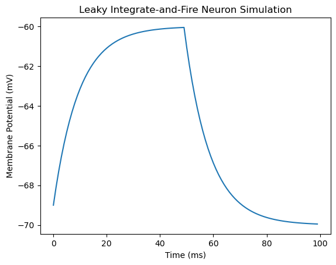
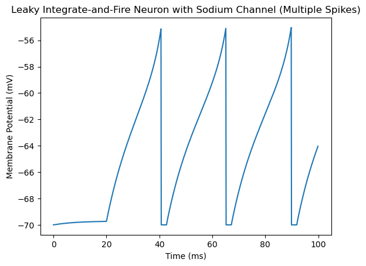

Group 3 - Alex Ramirez, Jackie Gore, Eva Duvaris, Steven Vacha, Ethan Chang

General Explanantion of the code: This code writes for a visualization of a simple LIF neuron that fires when the membrane potential exceeds the already defined "threshold" put in place. This code shows the neurons response to a step input current then shows the membrane potential changes over a period of time. We have two examples of the possible code to visualize below.


```python
import numpy as np
import matplotlib.pyplot as plt

class LIFNeuron:
    def __init__(self, tau_m, tau_ref, v_rest, v_thresh):
        # Neuron parameters
        self.tau_m = tau_m  # Membrane time constant
        self.tau_ref = tau_ref  # Refractory period
        self.v_rest = v_rest  # Resting potential
        self.v_thresh = v_thresh  # Threshold potential

        # Neuron state variables
        self.membrane_potential = v_rest  # Initial membrane potential
        self.refractory_time = 0  # Initial refractory time

    def update(self, dt, current_input):
        # Check if the neuron is in a refractory period
        if self.refractory_time > 0:
            # Neuron is in refractory period, reset membrane potential to resting potential
            self.refractory_time -= dt
            self.membrane_potential = self.v_rest
        else:
            # Update membrane potential using leaky integration
            dv = (-(self.membrane_potential - self.v_rest) + current_input) / self.tau_m * dt
            self.membrane_potential += dv

            # Check for threshold crossing
            if self.membrane_potential >= self.v_thresh:
                # Neuron has fired, reset membrane potential to resting potential
                self.membrane_potential = self.v_rest
                # Set refractory period
                self.refractory_time = self.tau_ref

        # Return the updated membrane potential
        return self.membrane_potential

# Simulation parameters
tau_m = 10.0  # Membrane time constant (ms)
tau_ref = 2.0  # Refractory period (ms)
v_rest = -70.0  # Resting potential (mV)
v_thresh = -55.0  # Threshold potential (mV)
dt = 1.0  # Time step (ms)
sim_time = 100  # Simulation time (ms)

# Create LIF neuron
neuron = LIFNeuron(tau_m, tau_ref, v_rest, v_thresh)

# Simulation loop
time_points = np.arange(0, sim_time, dt)
membrane_potentials = []

for t in time_points:
    # Inject a constant input current for demonstration purposes
    input_current = 10.0 if t < 50 else 0.0

    # Update neuron and store membrane potential
    membrane_potential = neuron.update(dt, input_current)
    membrane_potentials.append(membrane_potential)

# Plot results
plt.plot(time_points, membrane_potentials)
plt.title('Leaky Integrate-and-Fire Neuron Simulation')
plt.xlabel('Time (ms)')
plt.ylabel('Membrane Potential (mV)')
plt.show()

```


    

    


Question 4: Looking at the above visualization / based on what you know regarding the LIF model -- what aspect of this model is most unlike a real biological neuron? What is missing?
    
    The falling of the membrane potential around 70 ms is unlike a biological neuron. It does not account for real biological processes and things like ion channels. This visualization also does not show the adaptation of real neurons over time as it only shows one firing potential.

Question 5: what was the most challenging aspect of this homework?
    
    Having to go through the code and understand what was going on.

Question 6: Estimate how long it took you to complete this homework

    It took about 25 minutes.

Part 3:

1) Below your original document use markdown cells to write a paragraph explaining why the Leaky Integrate and Fire model needs to have voltage-gated sodium channels added to it in order to be a better model of a neuron and what doing this should theoretically accomplish / how it will change your visualizations 

    The LIF model needs voltage-gated sodium channels to be able to reach the membrane potnetial and reset back down.

2) Below the above paragraph copy your original LIF model and see if you can update it to include voltage-gated sodium channels and produce a new visualization 


```python
import numpy as np
import matplotlib.pyplot as plt

class LIFNeuron:
    def __init__(self, tau_m, tau_ref, v_rest, v_thresh, sodium_channel_params):
        # Neuron parameters
        self.tau_m = tau_m  # Membrane time constant
        self.tau_ref = tau_ref  # Refractory period
        self.v_rest = v_rest  # Resting potential
        self.v_thresh = v_thresh  # Threshold potential

        # Sodium channel parameters
        self.sodium_channel_params = sodium_channel_params
        self.m = 0.0  # Initial activation variable
        self.h = 1.0  # Initial inactivation variable

        # Neuron state variables
        self.membrane_potential = v_rest  # Initial membrane potential
        self.refractory_time = 0  # Initial refractory time

    def update_sodium_channel(self, dt):
        # Update sodium channel dynamics using Hodgkin-Huxley model
        alpha_m = self.sodium_channel_params['alpha_m'](self.membrane_potential)
        beta_m = self.sodium_channel_params['beta_m'](self.membrane_potential)
        alpha_h = self.sodium_channel_params['alpha_h'](self.membrane_potential)
        beta_h = self.sodium_channel_params['beta_h'](self.membrane_potential)

        dm_dt = alpha_m * (1 - self.m) - beta_m * self.m
        dh_dt = alpha_h * (1 - self.h) - beta_h * self.h

        self.m += dm_dt * dt
        self.h += dh_dt * dt

    def update(self, dt, current_input):
        # Check if the neuron is in a refractory period
        if self.refractory_time > 0:
            # Neuron is in refractory period, reset membrane potential to resting potential
            self.refractory_time -= dt
            self.membrane_potential = self.v_rest
        else:
            # Update sodium channel dynamics
            self.update_sodium_channel(dt)

            # Update membrane potential using leaky integration and sodium channel contribution
            dv = (-(self.membrane_potential - self.v_rest) + current_input + \
                  self.sodium_channel_params['g_Na'] * self.m**3 * self.h * \
                  (self.sodium_channel_params['E_Na'] - self.membrane_potential)) / self.tau_m * dt

            self.membrane_potential += dv

            # Check for threshold crossing
            if self.membrane_potential >= self.v_thresh:
                # Neuron has fired, reset membrane potential to resting potential
                self.membrane_potential = self.v_rest
                # Set refractory period
                self.refractory_time = self.tau_ref

        # Return the updated membrane potential
        return self.membrane_potential

# Sodium channel parameters (Hodgkin-Huxley model)
sodium_channel_params = {
    'alpha_m': lambda v: 0.1 * (v + 40) / (1 - np.exp(-(v + 40) / 10)),
    'beta_m': lambda v: 4.0 * np.exp(-(v + 65) / 18),
    'alpha_h': lambda v: 0.07 * np.exp(-(v + 65) / 20),
    'beta_h': lambda v: 1.0 / (1 + np.exp(-(v + 35) / 10)),
    'g_Na': 120.0,  # Sodium conductance (mS/cm^2)
    'E_Na': 50.0,   # Sodium reversal potential (mV)
}

# Simulation parameters
tau_m = 10.0  # Membrane time constant (ms)
tau_ref = 2.0  # Refractory period (ms)
v_rest = -70.0  # Resting potential (mV)
v_thresh = -55.0  # Threshold potential (mV)
dt = 0.1  # Time step (ms)
sim_time = 100  # Simulation time (ms)

# Create LIF neuron with sodium channels
neuron = LIFNeuron(tau_m, tau_ref, v_rest, v_thresh, sodium_channel_params)

# Simulation loop
time_points = np.arange(0, sim_time, dt)
membrane_potentials = []

for t in time_points:
    # Inject a step input current for demonstration purposes
    input_current = 10.0 if 20 < t < 100 else 0.0

    # Update neuron and store membrane potential
    membrane_potential = neuron.update(dt, input_current)
    membrane_potentials.append(membrane_potential)

# Plot results
plt.plot(time_points, membrane_potentials)
plt.title('Leaky Integrate-and-Fire Neuron with Sodium Channel (Multiple Spikes)')
plt.xlabel('Time (ms)')
plt.ylabel('Membrane Potential (mV)')
plt.show()

```


    

    

3) Use Markdown cells to comment on what changes had to be made and why or to discuss what went wrong/why you were unable to do this task if you struggled

The difference between the new LIF with the voltage-gated sodium channels and the old one without the channels is the inclusion of the sodium parameters. In the init method, a sodium channel parameter was added which initaies the activation/inactivation variables. We also had to add a method that updates the sodium channel dynamics which are updated when not in refractory period.

4) In another set of Markdown code comment on your ability to work collaboratively using Git-Hub. For instance, did you encounter any problems? How did you overcome them? Or are you still unable to make it work? (2pts) [Note: you don't technically have to use Github to work collaboratively -- you could write code in a google doc and have one person input it into JupyterLabs, but for this assignment I do suggest simply trying it out and learning to use this useful technology!]

It was difficult and confsuing trying to edit the previous the homework sumission. When trying to edit on github, the .ipynb file became all code and was very confusing to look at. So, we just indiviudally downloaded the file and tried to work on it on our own and then compared our work and tried to combine some charassteristics.

5) Finally, looking ahead, based on Lectures #5-6 -- give a prediction of how complicated you think the coding will be in order to model a simple feedforward neural network trained using gradient descent and backpropagation (you may need to look these terms up)? Why does it have to be so much more complicated than the LIF model and/or what does this increased complexity tell us about the information contained within it? 

It would be slightly complicated because we would need bias, and weights. To feedforward, we need to apply a non-linear function to all inputs and then determine the loss (compare actual/predicted). To backpropagate, we need to compute gradients of the loss which is to optimize the parameters. It's a lot of coding and then we would have to conduct a training loop and check for convergence.
It has to be more complicated than LIf modeling because LIF modeling is just simulating the nueron actiavtion spikes hwile the neural nnetwrok has to recognize patterns. 

